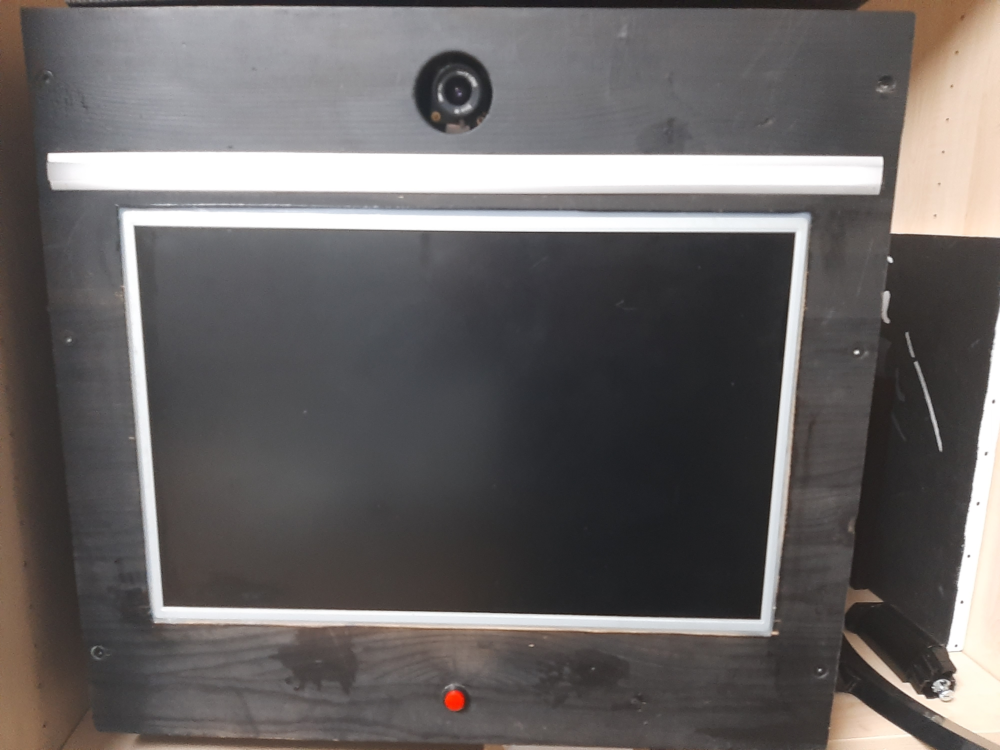
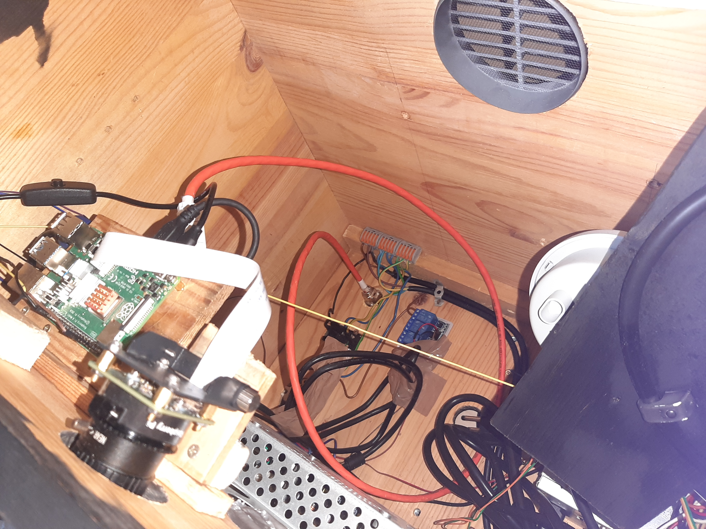

# fotos

fotos is a fotobox thing written in go

requirements:

- [https://go.dev/

- a raspberry pi

- optional:

  - `libcamera-apps` for `libcamera` (rpi only)

  -  `rpi-ws28`

    `1x` follow: https://github.com/rpi-ws281x/rpi-ws281x-go#compiling-directly-on-the-raspberry-pi

  - a internet connected server you can run the server on

how 2 use:

1. `git clone git@github.com:DerZombiiie/fotos.git `
   or: `git clone https://github.com/DerZombiiie/fotos.git`
2. configure:
   1. edit the `fotos/cmd/fotos/main.go`
   2. try to make sense of file
3. be annoyed and use a preconfigured instance:
   1. `fotos/cmd/preconfigured/main.go`
   2. go into that folder, compile, and run as **ROOT** (because of neopixel library)
4. Open a Issue on github so I can help you :), no really feel free to message me riley@e926.de

---

# Some pictures:

The Box:

The (totally 100% clean) inside

